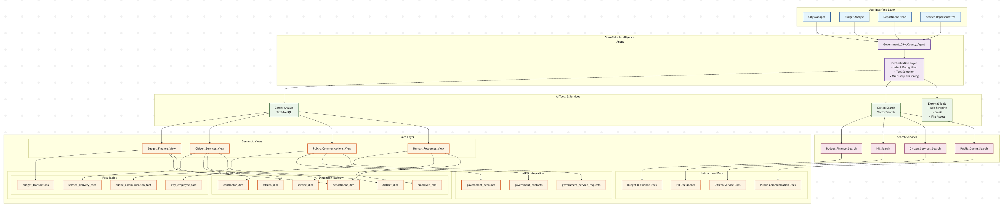

# 🏛️ Snowflake Intelligence - Government Demo

**Springfield City & County Government AI Analytics Platform**

A comprehensive demonstration of Snowflake Intelligence capabilities tailored for city and county government operations, featuring advanced AI-powered analytics, natural language querying, and document search across budget & finance, citizen services, public communications, and human resources domains.

---

## 🎯 **Demo Overview**

This demo showcases how government organizations can leverage Snowflake Intelligence to transform their data into actionable insights through:

- **🤖 AI-Powered Analytics**: Natural language queries that generate SQL and visualizations
- **📚 Document Intelligence**: Vector search across government policies and procedures  
- **🔄 Multi-Tool Orchestration**: Seamless integration between structured and unstructured data
- **📊 Government-Specific Insights**: Tailored for public sector use cases and terminology

---

## 🏗️ **Architecture Overview**



The platform integrates multiple Snowflake Intelligence services to provide comprehensive government analytics:

### **Core Components:**
- **Snowflake Intelligence Agent**: Government_City_County_Agent with orchestration capabilities
- **Cortex Analyst**: Text-to-SQL via semantic views optimized for government data
- **Cortex Search**: Vector search across government documents and policies
- **External Tools**: Web scraping, email notifications, and file access

### **Data Architecture:**
- **13 Dimension Tables**: Government entities (citizens, services, districts, departments, etc.)
- **4 Fact Tables**: Service delivery, budget transactions, communications, HR data
- **3 CRM Tables**: Government accounts, contacts, and service requests
- **Unstructured Documents**: Policies, procedures, reports, and guidelines

---

## 📊 **Government Domains**

### **🏦 Budget & Finance**
- **Data Sources**: Budget transactions, account dimensions, contractor spending
- **Key Metrics**: Monthly expenditures, department budgets, contractor performance
- **Use Cases**: Budget analysis, procurement oversight, financial planning

### **🏛️ Citizen Services**  
- **Data Sources**: Service delivery facts, citizen dimensions, service categories
- **Key Metrics**: Service completion rates, response times, citizen satisfaction
- **Use Cases**: Performance tracking, resource allocation, service optimization

### **📢 Public Communications**
- **Data Sources**: Communication campaigns, channels, citizen engagement
- **Key Metrics**: Campaign effectiveness, reach, engagement rates
- **Use Cases**: Outreach optimization, public engagement, communication ROI

### **👥 Human Resources**
- **Data Sources**: Employee facts, job dimensions, salary data, attrition tracking
- **Key Metrics**: Headcount, salary analysis, retention rates, performance
- **Use Cases**: Workforce planning, compensation analysis, retention strategies

---

## 🚀 **Quick Setup**

### **Prerequisites**
- Snowflake account with Intelligence capabilities enabled
- `ACCOUNTADMIN` privileges for initial setup
- Access to this GitHub repository

### **4-Step Installation**

Execute the SQL scripts in **exact order** in Snowflake Snowsight:

```sql
-- Step 1: Database Infrastructure (5-10 minutes)
-- Creates roles, warehouse, database, tables, and loads all data from GitHub
@sql_scripts/government_demo_setup.sql

-- Step 2: Semantic Views (2-3 minutes)  
-- Enables natural language queries via Cortex Analyst
@sql_scripts/government_semantic_views.sql

-- Step 3: Document Search (3-5 minutes)
-- Sets up Cortex Search for government documents
@sql_scripts/government_cortex_search_setup.sql

-- Step 4: AI Agent (2-3 minutes)
-- Creates the Government_City_County_Agent with full orchestration
@sql_scripts/government_agent_setup.sql
```

### **🎉 Start Using the Demo**
1. Navigate to **Snowflake Intelligence** in Snowsight
2. Find **"Government_City_County_Agent"** 
3. Start asking questions like:
   - *"What are our monthly budget expenditures for the last 12 months?"*
   - *"Which district has the highest service delivery costs and why?"*

**Total Setup Time: ~15 minutes** ⏱️

---

## 💬 **Sample Questions**

### **📈 Progressive Analysis Demo**
Experience how users can drill down from high-level insights to specific actionable recommendations:

#### **🔍 Discovery Phase**
- *"What are our monthly budget expenditures for the last 12 months?"*
- *"Which district has the highest service delivery costs and why?"*

#### **🔬 Analysis Phase**  
- *"Show me the detailed breakdown of service costs in District 3 - Westside by service category"*
- *"What specific services are driving up costs in District 3 and which contractors are involved?"*

#### **📚 Research Phase**
- *"Find policy documents related to infrastructure services and contractor management"*
- *"Which employees in District 3 handle the most expensive service requests?"*

#### **🚀 Action Phase**
- *"Create an action plan to optimize service delivery costs in District 3 based on historical data and policy guidelines"*

### **🎯 Domain-Specific Queries**
- *"How many citizen service requests were completed this quarter?"*
- *"What are our most effective public communication campaigns?"*
- *"What's our employee headcount by department?"*
- *"Show me service delivery performance trends across all districts over the past 2 years"*
- *"Which contractors have the highest spending and what services do they provide?"*

---

## 📋 **Data Model Details**

### **🌟 Star Schema Design**
Optimized for government analytics with historical data spanning 2020-2024:

#### **Dimension Tables (13)**
```
citizen_dim              - Citizen/resident information
service_dim              - Government services catalog  
service_category_dim     - Service classifications
district_dim             - Geographic districts/wards
department_dim           - Government departments
contractor_dim           - External contractors/vendors
city_employee_dim        - Government employees
account_dim              - Financial accounts
communication_channel_dim - Communication channels
public_communication_dim - Campaign details
government_job_dim       - Job titles and levels
government_location_dim  - Office locations
```

#### **Fact Tables (4)**
```
service_delivery_fact    - Service transactions (381 records, 2020-2024)
budget_transactions      - Financial transactions (381 records, 2020-2024)  
public_communication_fact - Campaign performance (381 records, 2020-2024)
city_employee_fact       - HR metrics (117 records, 2018-2024)
```

#### **CRM Integration (3)**
```
government_accounts      - Citizen accounts
government_contacts      - Contact information
government_service_requests - Service request tracking
```

### **📚 Unstructured Documents**
Government documents organized by department:

```
unstructured_docs/
├── budget_finance/
│   ├── Annual_Budget_2025.md
│   ├── Q4_2024_Financial_Report.md
│   └── Procurement_Policy_2025.md
├── citizen_services/
│   ├── Service_Delivery_Procedures.md
│   └── Citizen_Success_Stories.md
├── public_communications/
│   └── Public_Communication_Strategy_2025.md
├── human_resources/
│   └── Employee_Handbook_2025.md
└── government_operations/
    └── Strategic_Plan_2025-2030.md
```

---

## 🛠️ **Technical Implementation**

### **🧠 Semantic Views**
Four government-optimized semantic views enable natural language queries:

- **`BUDGET_FINANCE_SEMANTIC_VIEW`**: Financial transactions and budget analysis
- **`CITIZEN_SERVICES_SEMANTIC_VIEW`**: Service delivery and citizen engagement  
- **`PUBLIC_COMMUNICATIONS_SEMANTIC_VIEW`**: Campaign performance and outreach
- **`HUMAN_RESOURCES_SEMANTIC_VIEW`**: Employee data and workforce analytics

### **🔍 Cortex Search Services**
Domain-specific search services for document intelligence:

- **`SEARCH_BUDGET_FINANCE_DOCS`**: Financial policies and procedures
- **`SEARCH_CITIZEN_SERVICES_DOCS`**: Service delivery guidelines
- **`SEARCH_PUBLIC_COMMUNICATIONS_DOCS`**: Communication strategies
- **`SEARCH_HR_DOCS`**: Employee handbooks and HR policies

### **🤖 AI Agent Configuration**
The `Government_City_County_Agent` includes:

- **Multi-tool orchestration** across Cortex Analyst, Cortex Search, and external tools
- **Government-specific instructions** for public sector terminology and use cases
- **Progressive sample questions** demonstrating drill-down analysis capabilities
- **External integrations** for web scraping, email, and file access

---

## 📈 **Demo Scenarios**

### **Scenario 1: Budget Performance Investigation**
*A City Manager investigates budget overruns in a specific district*

1. **Discovery**: Identify which district has cost issues
2. **Analysis**: Break down costs by service category  
3. **Investigation**: Identify specific services and contractors
4. **Research**: Review relevant policies and procedures
5. **Personnel**: Analyze employee involvement and performance
6. **Action**: Generate data-driven optimization recommendations

### **Scenario 2: Service Delivery Optimization**
*Department Head analyzes citizen service performance*

- Query completion rates by service type
- Compare district performance metrics
- Identify bottlenecks and improvement opportunities
- Research best practices from policy documents

### **Scenario 3: Communication Campaign Analysis**
*Communications Director evaluates outreach effectiveness*

- Analyze campaign performance across channels
- Measure citizen engagement and response rates
- Compare ROI across different communication strategies
- Plan future campaigns based on historical data

### **Scenario 4: Workforce Planning**
*HR Director conducts retention analysis*

- Analyze employee turnover by department
- Compare salary benchmarks across roles
- Identify retention risks and patterns
- Develop targeted retention strategies

---

## 🔧 **Advanced Features**

### **📊 Data Consistency & Quality**
- **Extended Historical Data**: 5 years of data (2020-2024) for trend analysis
- **Consistent Date Ranges**: All fact tables aligned for accurate comparisons  
- **Data Validation**: Verified column mappings and semantic view accuracy
- **Realistic Patterns**: Seasonal variations and growth trends in synthetic data

### **🔍 Enhanced Search Capabilities**
- **Vector Search**: Semantic search across government documents
- **Contextual Results**: Relevant policy and procedure recommendations
- **Multi-domain Search**: Cross-departmental document discovery
- **Dynamic URL Generation**: Secure access to document content

### **🤝 Integration Capabilities**
- **GitHub Integration**: Automated data loading from repository
- **Web Scraping**: External data analysis and integration
- **Email Notifications**: Automated reporting and alerts
- **CRM Connectivity**: Salesforce-style government service tracking

---

## 🎓 **Learning Outcomes**

After experiencing this demo, users will understand:

### **✅ Snowflake Intelligence Capabilities**
- How Cortex Analyst transforms natural language into SQL and visualizations
- How Cortex Search provides intelligent document discovery
- How AI agents orchestrate multiple tools for complex analysis

### **✅ Government Use Cases**
- Budget analysis and procurement oversight
- Service delivery performance management  
- Public communication effectiveness measurement
- Workforce planning and retention analysis

### **✅ Implementation Best Practices**
- Semantic view design for domain-specific terminology
- Document organization for effective search
- Agent configuration for government workflows
- Data modeling for public sector analytics

---

## 🔒 **Security & Compliance**

### **Data Governance**
- Role-based access control with government-appropriate permissions
- Audit logging for all queries and data access
- Secure document storage and access controls
- Privacy protection for citizen and employee data

### **Compliance Features**
- Government data retention policies
- Audit trail for decision-making processes
- Secure handling of sensitive information
- Compliance with public sector data standards

---

## 📞 **Support & Resources**

### **Documentation**
- **`IMPLEMENTATION_GUIDE.md`**: Detailed setup instructions
- **`sql_scripts/README.md`**: Technical implementation details
- **Individual script documentation**: Inline comments and explanations

### **Troubleshooting**
- Common setup issues and solutions
- Data loading troubleshooting guides
- Agent configuration best practices
- Performance optimization tips

### **Contact Information**
- **Repository**: [https://github.com/sfc-gh-mvanmeurer/Snowflake_AI_DEMO](https://github.com/sfc-gh-mvanmeurer/Snowflake_AI_DEMO)
- **Issues**: Use GitHub Issues for bug reports and feature requests
- **Discussions**: GitHub Discussions for questions and community support

---

## 🎉 **Get Started Today!**

Transform your government data into actionable insights with Snowflake Intelligence. This demo provides everything needed to showcase the power of AI-driven analytics for public sector organizations.

**Ready to deploy?** Follow the [Getting Started](#-getting-started) guide above and start exploring your data with natural language queries in minutes!

---

*Built with ❤️ for government innovation using Snowflake Intelligence*
